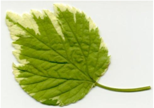
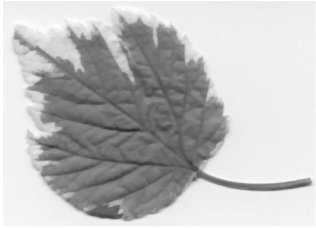
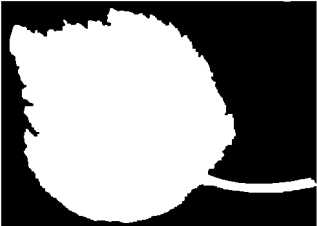
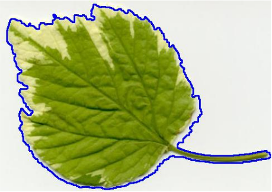
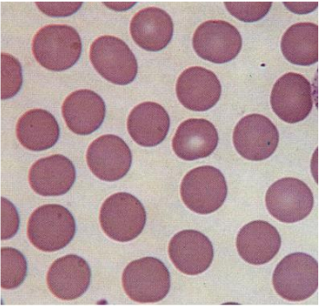
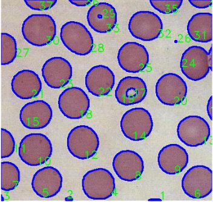

# Extração de objetos de interesse em imagens digitais utilizando a biblioteca de Visão Computacional OpenCV

O presente projeto teve como objetivo principal a modelagem e desenvolvimento de um algoritmo
capaz de identificar automaticamente objetos desconexos em uma imagem, contá-los e calcular a
área de cada objeto identificado. As aplicações para a ferramenta desenvolvida são as mais variadas,
podendo-se citar contagem de células, aplicações de sensoriamento remoto, avaliação de danos de
pragas em folhas de plantas, dentre outras. A aplicação foi desenvolvida na linguagem de
programação C++, em conjunto com a biblioteca OpenCV. Foram
obtidos resultados satisfatórios quando utilizadas imagens com padrões mais simples sendo
necessários mais estudos a fim de aprimorar a técnica desenvolvida para imagens mais complexas.

## Sobre o Projeto

Em primeiro lugar é carregada uma imagem RGB em que se deseja detectar os objetos, em
seguida se converte a imagem para uma escala de cinza, isso é feito porque a técnica de
limiarização utilizada necessita de imagens neste formato. A Figura 1 mostra o resultado dos passos
descritos anteriormente, em a) é apresentada a imagem original; em b) esta mesma imagem após a
transformação desta em tons de cinza e por fim, em c) a imagem após limiarização.

Após a limiarização, são processadas as operações de abertura e fechamento morfológicos.
Usando a imagem binária resultante aplicamos uma função para identificar os contornos presentes
na imagem, para isso é considerado que as partes em branco da imagem são onde existe algum
objeto e a parte em preto é o fundo. Com os contornos obtidos foram desenhados os contornos na
imagem original nos lugares onde foram identificados os objetos, e ainda escrevemos o numero
referente ao objeto identificado na imagem. A Figura 2 apresenta a imagem da Figura 1, após
processamento e a detecção do contorno do objeto selecionado.

Além da detecção dos objetos e rotulação dos mesmos, a aplicação criada gera um relatório,
no qual é possível obter a área deste objeto em pixels 2 . Para que se obtenha uma medida de área
correspondente ao mundo real, como por exemplo cm2, mm2 ou μm2, é necessário que a relação
pixel x unidade de medida seja calibrada no sistema e consequentemente será possível calcular a
área.

